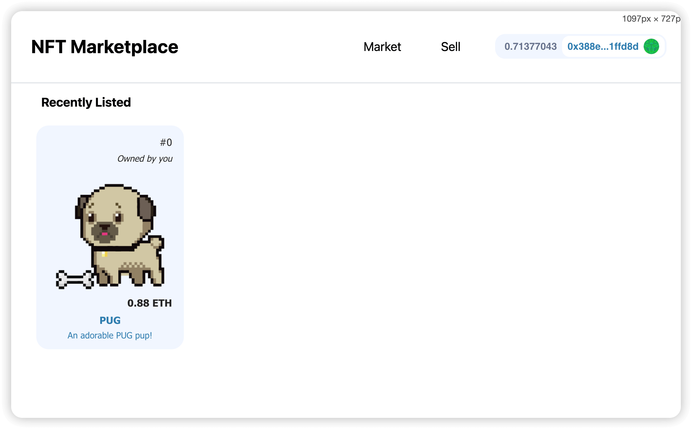
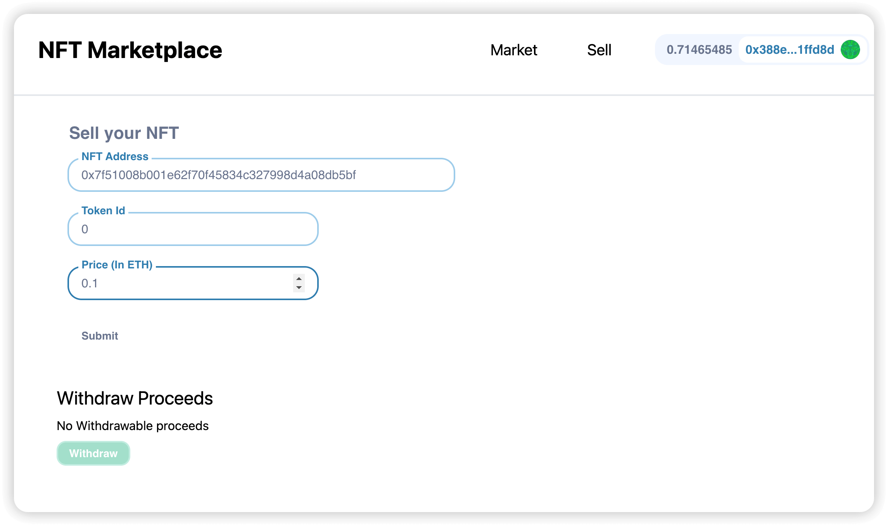
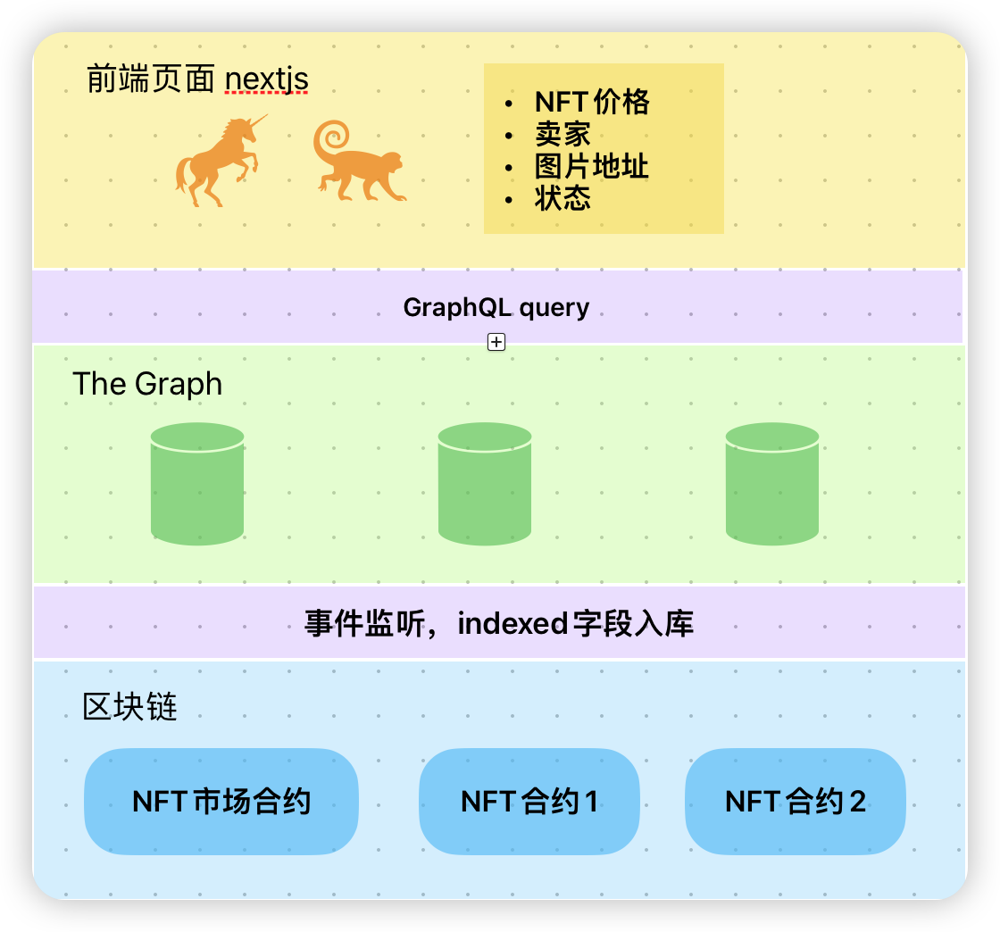

# NFT市场前端

一个简易的NFT交易市场

NextJs, Moralis, web3uikit, TheGraph, ApolloClient, graphql, typescript

NFT合约代码：https://github.com/whitefusion/hardhat-nft

NFT交易市场合约代码：https://github.com/whitefusion/hardhat-nft-marketplace

Graph代码（数据获取）：https://github.com/whitefusion/subgraph-nft-marketplace

## 页面设计
0. 右上按钮连接钱包
1. Market
    1. 列出在售的NFT
    2. 如果NFT是你的，你可以修改价格或者下架
    3. 如果NFT不是你的，你可以买入
2. Sell
    1. 输入NFT address和tokenId上架NFT
    2. 展示余额，提现

# 技术架构

- Index events with [the Graph](https://thegraph.com/)
- apollo client graphqu query
- moralis获取账户信息，调用合约方法
